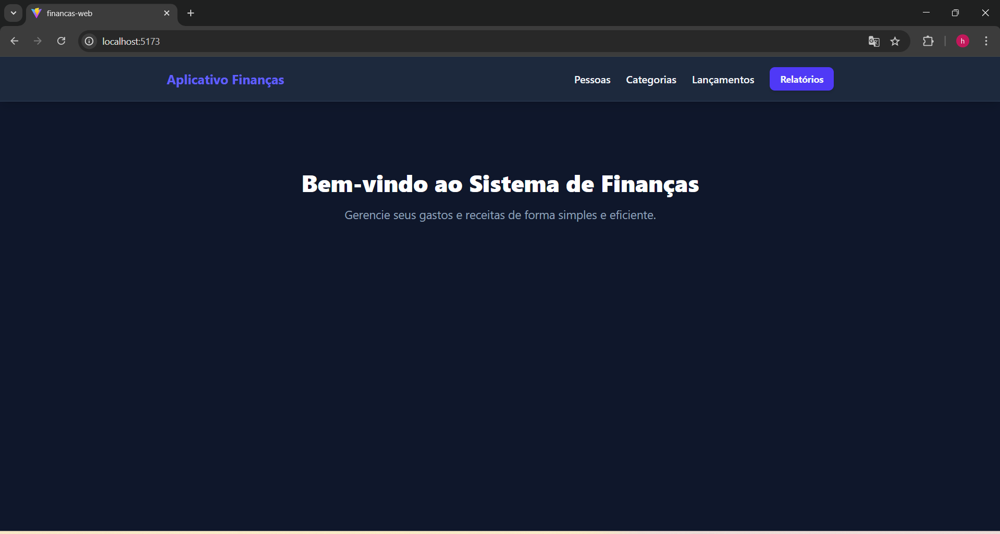
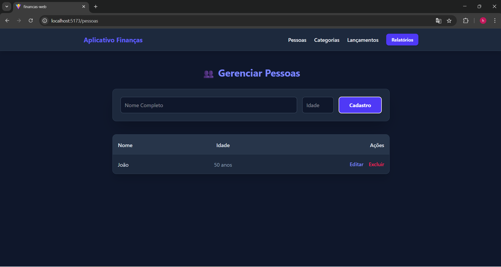
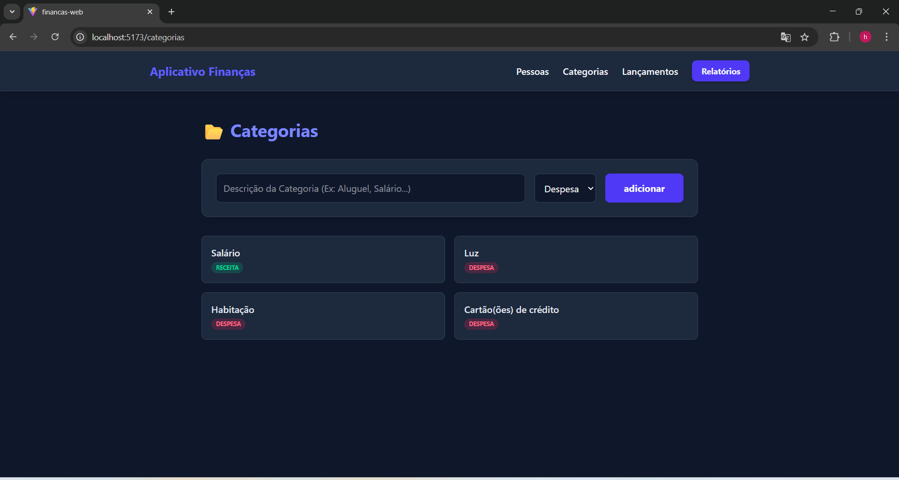
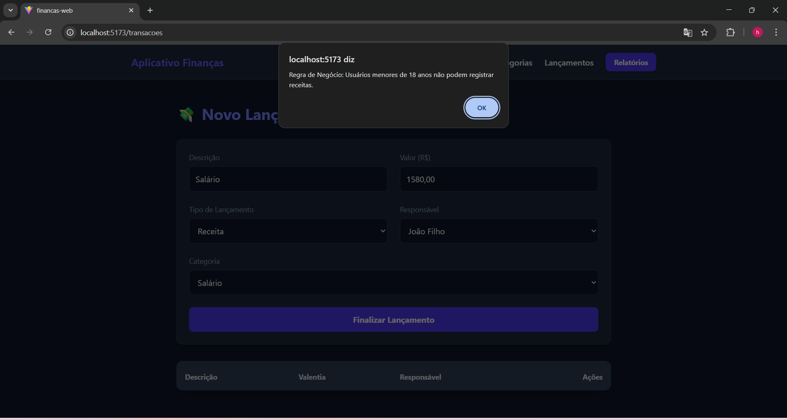
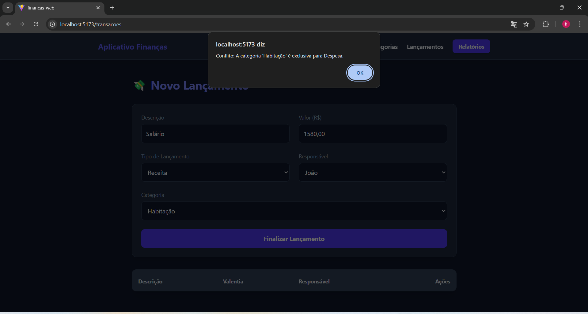
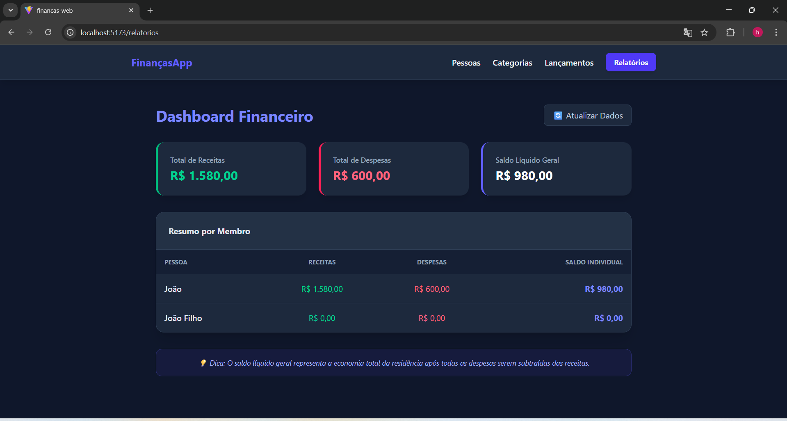

🚀 FinançasApp - Gestão de Finanças Residenciais
Sistema Full Stack desenvolvido para o controle de gastos familiares, focado em regras de negócio complexas, como validações de maioridade e integridade referencial.

🛠️ Tecnologias Utilizadas
Frontend: React, TypeScript, Tailwind CSS, Axios, Lucide React (ícones).

Backend: ASP.NET Core (Web API), Entity Framework Core.

Banco de Dados: SQLite (persistência local).

Ferramentas: Git, Migrations, Swagger (documentação da API).

💡 Funcionalidades Principais

Gestão de Pessoas: Cadastro e edição de membros da residência com persistência em banco de dados.

Controle de Categorias: Classificação de lançamentos por finalidade (Receita, Despesa ou Ambas).

Lançamentos Inteligentes:

Validação de Maioridade: Somente maiores de 18 anos podem registrar receitas.

Validação de Tipo de Categoria: Bloqueio de lançamentos incompatíveis com a finalidade da categoria.

Dashboard de Relatórios: Painel consolidado com saldo líquido geral e extrato individual por pessoa.

🧩 Desafios Técnicos Superados

🔄 Sincronização e Serialização

Um dos maiores desafios foi lidar com as referências cíclicas entre as entidades (Pessoa -> Transação -> Pessoa). Implementei a configuração de ReferenceHandler.IgnoreCycles no ASP.NET para garantir que o JSON fosse entregue de forma limpa ao frontend, permitindo a exibição dinâmica de nomes nas tabelas.

🛡️ Integridade e Migrations

Garanti a integridade dos dados utilizando Entity Framework Migrations, tratando erros de exclusão vinculada (Restrição de Chave Estrangeira) e implementando lógica de atualização (PUT) com validação de ID e estados de entidade.

⚙️ Como executar o projeto

1. Backend

   Bash

cd Financas.Api

dotnet restore

dotnet ef database update

dotnet run

3. Frontend

   Bash

cd financas-web

npm install

npm run dev

🏛️ Decisões de Projeto e Arquitetura
Para este desafio, optei por uma Arquitetura Cliente-Servidor com separação total de responsabilidades, visando escalabilidade e facilidade de manutenção.

1. Camada de Back-end (.NET Web API)

Padrão REST: A API foi construída seguindo os princípios RESTful, utilizando verbos HTTP (GET, POST, PUT, DELETE) de forma semântica para gerenciar os recursos de Pessoas, Categorias e Transações.

Arquitetura em Camadas: Organizei o código em pastas de Models (Domínio), Data (Persistência) e Controllers (Orquestração), garantindo que a lógica de acesso a dados não fique misturada com as regras de negócio.

Entity Framework Core & Migrations: Escolhi o EF Core com a estratégia Code First. Isso permite que o banco de dados (SQLite) seja uma representação fiel das classes C#, facilitando a evolução do esquema através de migrations rastreáveis pelo Git.

Serialização Avançada: Configurei o ReferenceHandler.IgnoreCycles no pipeline de serialização JSON. Isso foi fundamental para permitir que o frontend receba objetos relacionados (como o nome da Pessoa dentro de uma Transação) sem causar loops infinitos de referência.

2. Camada de Front-end (React + TypeScript)

Tipagem Forte com TypeScript: Utilizei interfaces para definir todos os contratos de dados vindos da API. Isso reduz drasticamente bugs em tempo de execução e melhora a experiência de desenvolvimento (IntelliSense).

Componentização e Hooks: O uso de useEffect e useState permitiu uma interface reativa, onde os relatórios e listas são atualizados automaticamente após qualquer operação de CRUD.

Axios para Comunicação: Optei pelo Axios pela sua facilidade em lidar com interceptores e pelo tratamento robusto de erros vindos da API, permitindo dar feedbacks claros ao usuário (como a regra de maioridade).

3. Regras de Negócio e Segurança

Validação em Duas Camadas: As regras críticas (ex: menor de 18 anos não registra receita) foram implementadas no Back-end para garantir a segurança dos dados e no Front-end para agilizar o feedback ao usuário.

Integridade Referencial: Implementei a exclusão em cascata para garantir que, ao remover uma Pessoa, o sistema não deixe transações "órfãs" no banco de dados, cumprindo rigorosamente os requisitos do desafio.

Desenvolvido por Hélio - 2025
